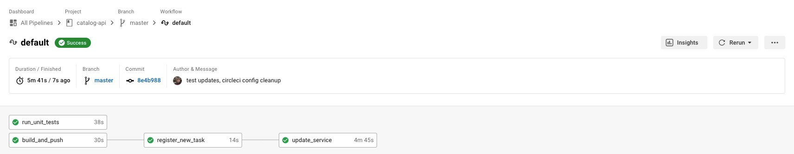

 

# Cronenberg's Discogs API
This project is a "clone" of the public [Discogs API](https://api.discogs.com/) built using [FastAPI.](https://github.com/tiangolo/fastapi) Data is stored in [DynamoDB](https://aws.amazon.com/dynamodb/) using a single-table design. (Shout out to Alex DeBrie for putting together an excellent resource explaining [this tricky concept.](https://www.alexdebrie.com/posts/dynamodb-single-table/)) It's using a very limited dataset pulled from Discogs.

The API itself was actually a secondary focus; my main goals were to: 
1. Get hands-on experience with DynamoDB, specifically optimized table design
2. Have a "real world" project I could use to work with CircleCI, Terraform, and ECS. [The main Terraform project can be found here.](https://github.com/animaldna/aws-ecs-tf-public)

## Technologies
- Python 3.9
- fastAPI 0.70.1
- slowapi 0.1.5
- Uvicorn 0.16.0
- boto3 1.20.23
- DynamoDB
- CircleCI

<!-- ## Usage
A working version is hosted at [https://catalog-api.chloeboylan.work](https://catalog-api.chloeboylan.work). There are two sets of docs available at [/docs](https://catalog-api.chloeboylan.work/docs) and [/redoc.](https://catalog-api.chloeboylan.work/redoc) I don't want to wake up to an absurd AWS bill, so it's rate-limited to 5 requests/minute in case someone tries to blast it for whatever reason. :) -->

## CI/CD Pipeline
The default pipeline pulls the task template from ECS, updates it with jq, registers the new task definition, and updates the service. Everything but the build step runs on a custom image based on python:3.9-buster-slim. 

### CircleCI TODOs
- [ ] Slack notifications
- [ ] Version with deployment via runner
- [ ] Version with deployment via Lambda
- [ ] Version with CodePipeline blue/green deployment
- [ ] Slack approvals

## API TODOs
Right now I'm focused on the CI/CD pipeline and project infrastructure, so the API TODOs are back-burner.

#### Routes
- [ ] /albums?genre="foo"&style="bar"
- [ ] /albums/latest
- [ ] /albums?artist=1234567 (alias for /artists/1234567/albums)
- [ ] /albums
- [ ] /artists
#### Misc.
- [ ] Logging
- [ ] Sorting
- [ ] Pagination

## Feedback
This is a personal project and a work in progress, but I'm always open to receiving any and all feedback about anything I'm working on. Feel free to open an issue and drop your thoughts.

## Author
Chloe Boylan

## License
Copyright © 2021 Chloe Boylan.
This project is MIT licensed.